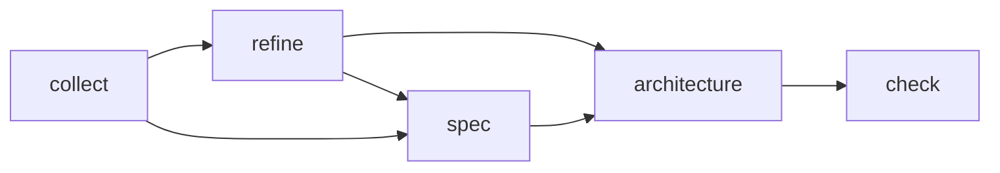
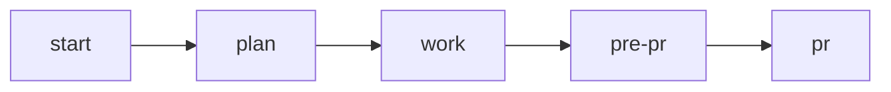

# Fluxo de Desenvolvimento Product On Rails

## Recursos Adicionais

- **[MCPs.md](MCPs.md)** - Referência de MCP Servers úteis para desenvolvimento

## CLAUDE.md

O arquivo CLAUDE.md.example contém um exemplo inicial de como configurar seu arquivo CLAUDE.md.
Ele deve ser copiado para CLAUDE.md e editado de acordo com as necessidades do projeto / usuário.
No exemplo, usamos um conteúdo sucinto para drivar alguns comportamentos do agente: 

- Confirmar dúvidas antes de agir
- Usar um tom direto
- Fazer pesquisas quando necessário

Este arquivo tem o intuito de ser usado como o CLAUDE.md principal, em `~/.claude/CLAUDE.md`. Fora ele, cada projeto deve ter seu próprio CLAUDE.md que deve focar nas boas práticas daquele repositório. Ele pode ser gerado com o comando `/init` do CLAUDE.

## AGENTS

Os agentes são usados na orquestração para economizar context window. Os arquivos na pasta .claude/agents são usados para definir os prompts dos agentes.

Temos diversos arquivos de exemplo nesta pasta. Você pode e deve modifica-los de acordo com as preferencias do seu projeto. 

### Agentes principais

| Agente | Descrição |
|--------|-----------|
| [python-developer.md](.claude/agents/python-developer.md) | Usado para desenvolvimento de código em Python |
| [react-developer.md](.claude/agents/react-developer.md) | Usado para desenvolvimento de código em React |
| [code-reviewer.md](.claude/agents/code-reviewer.md) | Usado para revisão de código |
| [research-agent.md](.claude/agents/research-agent.md) | Usado para pesquisa na web ou em outros codebases |
| [test-engineer.md](.claude/agents/test-engineer.md) | Usado para desenvolvimento de testes |
| [test-planner.md](.claude/agents/test-planner.md) | Usado para planejamento de testes |
| [metaspec-gate-keeper.md](.claude/agents/metaspec-gate-keeper.md) | Usado para verificação do código versus os metaspec do projeto |

### Agentes específicos para momento de PR

| Agente | Descrição |
|--------|-----------|
| [branch-code-reviewer.md](.claude/agents/branch-code-reviewer.md) | Usado para revisão de código da branch |
| [branch-metaspec-checker.md](.claude/agents/branch-metaspec-checker.md) | Usado para verificação do código da branch versus os metaspec do projeto |
| [branch-documentation-writer.md](.claude/agents/branch-documentation-writer.md) | Usado para documentação da branch |
| [branch-test-planner.md](.claude/agents/branch-test-planner.md) | Usado para planejamento de testes da branch |

## COMMANDS

### Product

| Comando | Descrição |
|---------|-----------|
| [/warm-up](.claude/commands/warm-up.md) | Refresca a memória do agente sobre o que é o projeto |
| [/check](.claude/commands/check.md) | Checa se os requirements batem com as meta specs |
| [/collect](.claude/commands/collect.md) | Coleta um novo requirement rapidamente, sem muita pergunta |
| [/refine](.claude/commands/refine.md) | Faz um refinamento básico no requirement (WHY/WHAT/HOW) |
| [/spec](.claude/commands/spec.md) | Especifica o requirement em detalhes (deixe no seu formato de PRD) |
| [/architecture](.claude/commands/architecture.md) | Faz o desenho da arquitetura do projeto |

A ordem de execução deste fluxo é:

PS. Não é necessário sempre executar spec e depois refine. Você pode fazer apenas um deles e seguir de acordo com a complexidade do card. Uma outra prática interessante é fazer o refine dos cards o mais rápido possível para ter uma documentação boa e padronizada, mas deixar o spec para depois, quando for a hora de gastar mais tempo no card. 

#### Configurando o Claude Desktop

Se você estiver usando o Claude Desktop, você pode criar um agente para servir como seu agente de produto. É recomando, uma vez que os times de produto não possuem muita experiência com VS Code.

Para isso, configure-o da seguinte maneira: 

- Crie um projeto no Claude, exemplo: "Product Manager". 
- Copie o prompt em [claude-desktop/prompt.md](claude-desktop/prompt.md) na área de instruções do projeto - faça ajustes necessários para o seu caso de uso
- Coloque todos os comandos de produto dentro do Claude como documentos para que o agente possa interpretar comandos normalmente.

Agora você pode usar o Claude Desktop para interagir com o seu agente de produto.

### Engineering

Os comandos são atalhos para prompts que são utilizados no nosso processo de desenvolvimento. O processo todo é composto da execução dos comandos na seguinte ordem: 

#### [/start](.claude/commands/start.md)

Este comando inicia o processo de desenvolvimento em uma branch. Ele garante que estamos em uma branch, e cria uma pasta dentro de .claude/sessions com o mesmo nome da branch para armazenar seus documentos intermediários. 

1. Chame o comando com o card ou com o caminho de um arquivo com os requirements (boa prática é criar um arquivo requirements.md na pasta sessions/<branch-name>)
2. AI vai ler os requirements e gerar uma lista de perguntas para clarificar o que deve ser feito. Responda as perguntas dando o direcionamento adequado. 
3. AI vai gerar um arquivo context.md na pasta sessions/<branch-name> mostrando seu entendimento do card. Itere neste arquivo até estar correto.
4. AI vai gerar um arquivo architecture.md na pasta sessions/<branch-name> mostrando sua proposta de arquitetura. Itere neste arquivo até estar correto.

#### [/plan](.claude/commands/plan.md)

Este comando inicia o processo de planejamento de desenvolvimento em uma branch. Ele vai ler os documentos intermediários e criar um arquivo plan.md na pasta sessions/<branch-name> mostrando sua proposta de planejamento em etapas. O prompt pede que ele quebre em pedaços para ficar mais fácil fazer o gerenciamento das sessões. 

#### [/work](.claude/commands/work.md)

Este comando inicia o processo de desenvolvimento em uma branch. Ele vai ler os documentos intermediários, encontrar o plano, identificar em qual etapa do plano está e começar a coda-la. Ele está instruído para pedir sua aprovação explicita antes de seguir (mude isso se quiser), recomendo deixar. 

Boa prática: vá fazendo commits conforme cada phase é completada para poder voltar atrás caso aconteça algum problema. 

#### [/pre-pr](.claude/commands/pre-pr.md)

Este comando inicia o processo de pré-PR em uma branch. Ele vai executar 4 agentes para garantir que nosso código está de acordo com o nosso objetivo: 

1. `branch-metaspec-checker`.
2. `branch-code-reviewer`
3. `branch-documentation-writer`
4. `branch-test-planner`

#### [/pr](.claude/commands/pr.md)

Este comando inicia o processo de PR em uma branch. Configure-o para deixá-lo compatível com seu próprio fluxo de PR.

## FAQ

### Como eu forneço acesso as metaspecs para os agentes?

Você pode entregar seus metaspecs de várias maneiras:
- Passando o caminho local da sua maquina
- Passando o repositório diretamente
- Usando algum MCP como [Code Expert](https://github.com/lfnovo/code-expert-mcp) ou [RepoPrompt](https://repoprompt.com/).
- Usando algum MCP onde esteja a documentação como Notion, Confluence, etc. 

Depois, basta informar ao agente onde encontrar os metaspecs. 
- No caso do Claude Desktop, coloque no prompt de instruções
- No caso do Claude Code, coloque no arquivo CLAUDE.md do usuário ou do repositório

### Como eu forneço acesso ao codebase para os agentes consultarem?

Você pode oferecer acesso ao codebase de 3 maneiras:

- Passando o caminho local da sua maquina
- Passando o repositório diretamente
- Usando algum MCP como [Code Expert](https://github.com/lfnovo/code-expert-mcp) ou [RepoPrompt](https://repoprompt.com/).

Depois, basta informar ao agente onde encontrar o código. 
- No caso do Claude Desktop, coloque no prompt de instruções
- No caso do Claude Code, coloque no arquivo CLAUDE.md do usuário ou do repositório

Claude Code já tem acesso ao repositório local, obviamente. Este passo é apenas para quando ele precisa acessar outros repos do projeto.

