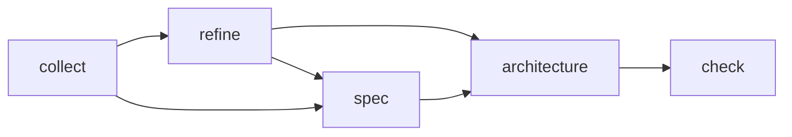
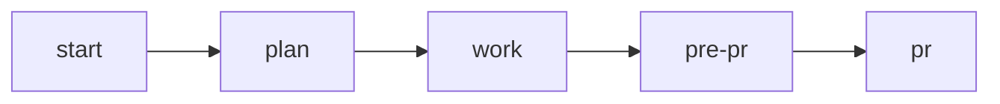
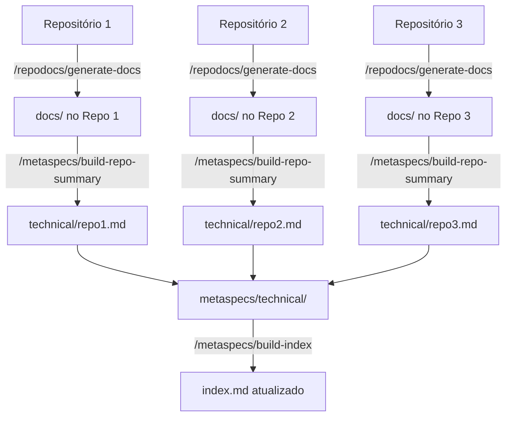

# Fluxo de Desenvolvimento Product On Rails

## Recursos Adicionais

- **[MCPs.md](MCPs.md)** - Referência de MCP Servers úteis para desenvolvimento

## CLAUDE.md

O arquivo CLAUDE.md.example contém um exemplo inicial de como configurar seu arquivo CLAUDE.md.
Ele deve ser copiado para CLAUDE.md e editado de acordo com as necessidades do projeto / usuário.
No exemplo, usamos um conteúdo sucinto para drivar alguns comportamentos do agente: 

- Confirmar dúvidas antes de agir
- Usar um tom direto
- Fazer pesquisas quando necessário

Este arquivo tem o intuito de ser usado como o CLAUDE.md principal, em `~/.claude/CLAUDE.md`. Fora ele, cada projeto deve ter seu próprio CLAUDE.md que deve focar nas boas práticas daquele repositório. Ele pode ser gerado com o comando `/init` do CLAUDE.

## AGENTS

Os agentes são usados na orquestração para economizar context window. Os arquivos na pasta .claude/agents são usados para definir os prompts dos agentes.

Temos diversos arquivos de exemplo nesta pasta. Você pode e deve modifica-los de acordo com as preferencias do seu projeto. 

### Agentes principais

| Agente | Descrição |
|--------|-----------|
| [python-developer.md](.claude/agents/python-developer.md) | Usado para desenvolvimento de código em Python |
| [react-developer.md](.claude/agents/react-developer.md) | Usado para desenvolvimento de código em React |
| [code-reviewer.md](.claude/agents/code-reviewer.md) | Usado para revisão de código |
| [research-agent.md](.claude/agents/research-agent.md) | Usado para pesquisa na web ou em outros codebases |
| [test-engineer.md](.claude/agents/test-engineer.md) | Usado para desenvolvimento de testes |
| [test-planner.md](.claude/agents/test-planner.md) | Usado para planejamento de testes |
| [metaspec-gate-keeper.md](.claude/agents/metaspec-gate-keeper.md) | Usado para verificação do código versus os metaspec do projeto |

### Agentes específicos para momento de PR

| Agente | Descrição |
|--------|-----------|
| [branch-code-reviewer.md](.claude/agents/branch-code-reviewer.md) | Usado para revisão de código da branch |
| [branch-metaspec-checker.md](.claude/agents/branch-metaspec-checker.md) | Usado para verificação do código da branch versus os metaspec do projeto |
| [branch-documentation-writer.md](.claude/agents/branch-documentation-writer.md) | Usado para documentação da branch |
| [branch-test-planner.md](.claude/agents/branch-test-planner.md) | Usado para planejamento de testes da branch |

## COMMANDS


### Product


| Comando | Descrição |
|---------|-----------|
| [/warm-up](.claude/commands/product/warm-up.md) | Refresca a memória do agente sobre o que é o projeto |
| [/check](.claude/commands/product/check.md) | Checa se os requirements batem com as meta specs |
| [/collect](.claude/commands/product/collect.md) | Coleta um novo requirement rapidamente, sem muita pergunta |
| [/refine](.claude/commands/product/refine.md) | Faz um refinamento básico no requirement (WHY/WHAT/HOW) |
| [/spec](.claude/commands/product/spec.md) | Especifica o requirement em detalhes (deixe no seu formato de PRD) |
| [/architecture](.claude/commands/product/architecture.md) | Faz o desenho da arquitetura do projeto |

A ordem de execução deste fluxo é:



PS. Não é necessário sempre executar spec e depois refine. Você pode fazer apenas um deles e seguir de acordo com a complexidade do card. Uma outra prática interessante é fazer o refine dos cards o mais rápido possível para ter uma documentação boa e padronizada, mas deixar o spec para depois, quando for a hora de gastar mais tempo no card. 

#### Configurando o Claude Desktop

Se você estiver usando o Claude Desktop, você pode criar um agente para servir como seu agente de produto. É recomando, uma vez que os times de produto não possuem muita experiência com VS Code.

Para isso, configure-o da seguinte maneira: 

- Crie um projeto no Claude, exemplo: "Product Manager". 
- Copie o prompt em [claude-desktop/prompt.md](claude-desktop/prompt.md) na área de instruções do projeto - faça ajustes necessários para o seu caso de uso
- Coloque todos os comandos de produto dentro do Claude como documentos para que o agente possa interpretar comandos normalmente.

Agora você pode usar o Claude Desktop para interagir com o seu agente de produto.


### Engineering

Os comandos são atalhos para prompts que são utilizados no nosso processo de desenvolvimento. O processo todo é composto da execução dos comandos na seguinte ordem: 



#### [/start](.claude/commands/engineer/start.md)

Este comando inicia o processo de desenvolvimento em uma branch. Ele garante que estamos em uma branch, e cria uma pasta dentro de .claude/sessions com o mesmo nome da branch para armazenar seus documentos intermediários.

1. Chame o comando com o card ou com o caminho de um arquivo com os requirements (boa prática é criar um arquivo requirements.md na pasta sessions/<branch-name>)
2. AI vai ler os requirements e gerar uma lista de perguntas para clarificar o que deve ser feito. Responda as perguntas dando o direcionamento adequado.
3. AI vai gerar um arquivo context.md na pasta sessions/<branch-name> mostrando seu entendimento do card. Itere neste arquivo até estar correto.
4. AI vai gerar um arquivo architecture.md na pasta sessions/<branch-name> mostrando sua proposta de arquitetura. Itere neste arquivo até estar correto.

#### [/plan](.claude/commands/engineer/plan.md)

Este comando inicia o processo de planejamento de desenvolvimento em uma branch. Ele vai ler os documentos intermediários e criar um arquivo plan.md na pasta sessions/<branch-name> mostrando sua proposta de planejamento em etapas. O prompt pede que ele quebre em pedaços para ficar mais fácil fazer o gerenciamento das sessões.

#### [/work](.claude/commands/engineer/work.md)

Este comando inicia o processo de desenvolvimento em uma branch. Ele vai ler os documentos intermediários, encontrar o plano, identificar em qual etapa do plano está e começar a coda-la. Ele está instruído para pedir sua aprovação explicita antes de seguir (mude isso se quiser), recomendo deixar.

Boa prática: vá fazendo commits conforme cada phase é completada para poder voltar atrás caso aconteça algum problema.

#### [/pre-pr](.claude/commands/engineer/pre-pr.md)

Este comando inicia o processo de pré-PR em uma branch. Ele vai executar 4 agentes para garantir que nosso código está de acordo com o nosso objetivo:

1. `branch-metaspec-checker`.
2. `branch-code-reviewer`
3. `branch-documentation-writer`
4. `branch-test-planner`

#### [/pr](.claude/commands/engineer/pr.md)

Este comando inicia o processo de PR em uma branch. Configure-o para deixá-lo compatível com seu próprio fluxo de PR.

## DOCUMENTAÇÃO

O framework oferece dois fluxos de documentação dependendo da complexidade da sua estrutura de repositórios:

### Documentação de Projeto Único

Para projetos com um único repositório, use os comandos de metaspecs:

| Comando | Descrição |
|---------|-----------|
| [/metaspecs/build-tech-docs](.claude/commands/metaspecs/build-tech-docs.md) | Gera documentação técnica completa do projeto |
| [/metaspecs/build-business-docs](.claude/commands/metaspecs/build-business-docs.md) | Gera documentação de negócio e contexto do projeto |
| [/metaspecs/build-index](.claude/commands/metaspecs/build-index.md) | Gera ou atualiza o índice de documentação |

### Documentação Multi-Repositório

Para projetos com **múltiplos repositórios**, use o processo recursivo de documentação:



#### Passo 1: Gerar Documentação em Cada Repositório

Execute em **cada repositório** do seu projeto:

```bash
/repodocs/generate-docs
```

Este comando irá:
1. Analisar a estrutura do repositório (stack, arquitetura, padrões)
2. Fazer perguntas sobre funcionalidades, APIs, microserviços e integrações
3. Gerar documentação completa na pasta `docs/` incluindo:
   - `stack.md` - Stack tecnológica e arquitetura
   - `patterns.md` - Padrões de design utilizados
   - `features.md` - Lista de funcionalidades
   - `business-rules.md` - Regras de negócio implementadas
   - `integrations.md` - Comunicação com outros serviços/repositórios
   - `apis.md` - Descrição de APIs (se aplicável)
   - `services.md` - Regras de microserviços (se aplicável)
   - `index.md` - Índice apontando para todos os arquivos

**Importante**: Este comando se adapta ao tipo de repositório (API, microserviço, biblioteca, frontend) e gera apenas os arquivos relevantes.

#### Passo 2: Consolidar Resumos nas Metaspecs

Na pasta de metaspecs do projeto, execute para cada repositório:

```bash
/metaspecs/build-repo-summary <caminho-do-repo> [caminho-de-saída]
```

**Exemplos de uso:**

```bash
# Gera: technical/payment-api.md
/metaspecs/build-repo-summary ~/dev/payment-api

# Gera: technical/apis/payment.md
/metaspecs/build-repo-summary ~/dev/payment-api apis/payment.md

# Gera: technical/core/lib.md
/metaspecs/build-repo-summary https://github.com/org/core-lib core/lib.md
```

Este comando irá:
1. Ler a documentação da pasta `docs/` do repositório
2. Criar um resumo executivo contendo:
   - **Propósito e papel** do repositório no ecossistema
   - **Funcionalidades principais** (top 5-7)
   - **Stack básica** (linguagem, framework, banco de dados)
   - **Relações com outros repositórios** e serviços

O resumo é otimizado para permitir que agentes de IA arquitetos identifiquem rapidamente em quais repositórios precisam atuar ao planejar novas features.

#### Passo 3: Atualizar Índice Geral

Depois de consolidar todos os resumos, atualize o índice:

```bash
/metaspecs/build-index
```

### Organização Recomendada de Metaspecs Multi-Repositório

```
metaspecs/
├── technical/
│   ├── core/
│   │   ├── main-app.md
│   │   └── shared-lib.md
│   ├── apis/
│   │   ├── payment.md
│   │   ├── user.md
│   │   └── notification.md
│   ├── services/
│   │   ├── auth-service.md
│   │   └── analytics-service.md
│   └── frontend/
│       ├── web-app.md
│       └── mobile-app.md
└── index.md
```

### Quando Usar Cada Abordagem?

**Use Documentação de Projeto Único quando:**
- Você tem apenas um repositório
- Toda a lógica está centralizada
- É um projeto monolítico

**Use Documentação Multi-Repositório quando:**
- Você tem múltiplos repositórios relacionados
- Arquitetura de microserviços
- Múltiplas equipes trabalhando em repos diferentes
- Necessidade de visão consolidada do ecossistema

## FAQ

### Como eu forneço acesso as metaspecs para os agentes?

Você pode entregar seus metaspecs de várias maneiras:
- Passando o caminho local da sua maquina
- Passando o repositório diretamente
- Usando algum MCP como [Code Expert](https://github.com/lfnovo/code-expert-mcp) ou [RepoPrompt](https://repoprompt.com/).
- Usando algum MCP onde esteja a documentação como Notion, Confluence, etc. 

Depois, basta informar ao agente onde encontrar os metaspecs. 
- No caso do Claude Desktop, coloque no prompt de instruções
- No caso do Claude Code, coloque no arquivo CLAUDE.md do usuário ou do repositório

### Como eu forneço acesso ao codebase para os agentes consultarem?

Você pode oferecer acesso ao codebase de 3 maneiras:

- Passando o caminho local da sua maquina
- Passando o repositório diretamente
- Usando algum MCP como [Code Expert](https://github.com/lfnovo/code-expert-mcp) ou [RepoPrompt](https://repoprompt.com/).

Depois, basta informar ao agente onde encontrar o código. 
- No caso do Claude Desktop, coloque no prompt de instruções
- No caso do Claude Code, coloque no arquivo CLAUDE.md do usuário ou do repositório

Claude Code já tem acesso ao repositório local, obviamente. Este passo é apenas para quando ele precisa acessar outros repos do projeto.


